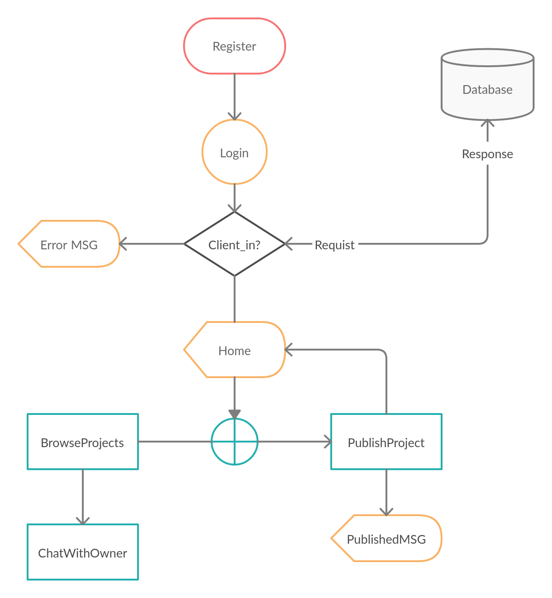

# FindPartner Requirments

## Vision

This is the initial version of FinPartner service app that highlights the difficulties of finding a suited partner for people's projects

## In of scope

- FindPartner would allow users to publish a post describing the business or entertainment event and the skills needed from the suited partner.
- FindPartner would allow users to look for a chance to participate with other published posts from other users.
- FindPartner would allow users to chat in private so they can discuss their idea.

## Out of scope

 FindPartner is an environment or tool that users use to communicate but will not be a business partner with the users.

## Functional Requirements

- users should login their account.
- users can create a project post with description.
- user can browse other projects.
- users can chat with the publisher in private.
- users can participate in the project.

## The basic dataflow

## Non-Functional Requirements
